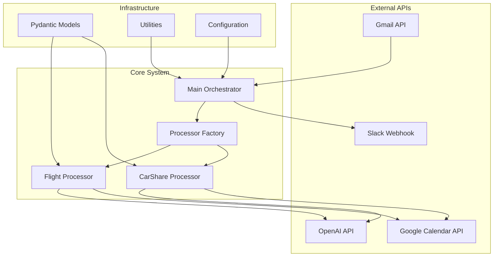
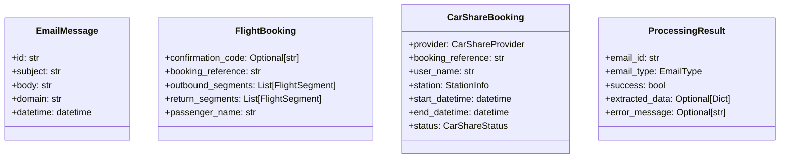
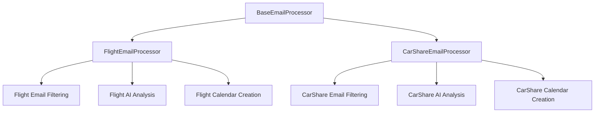
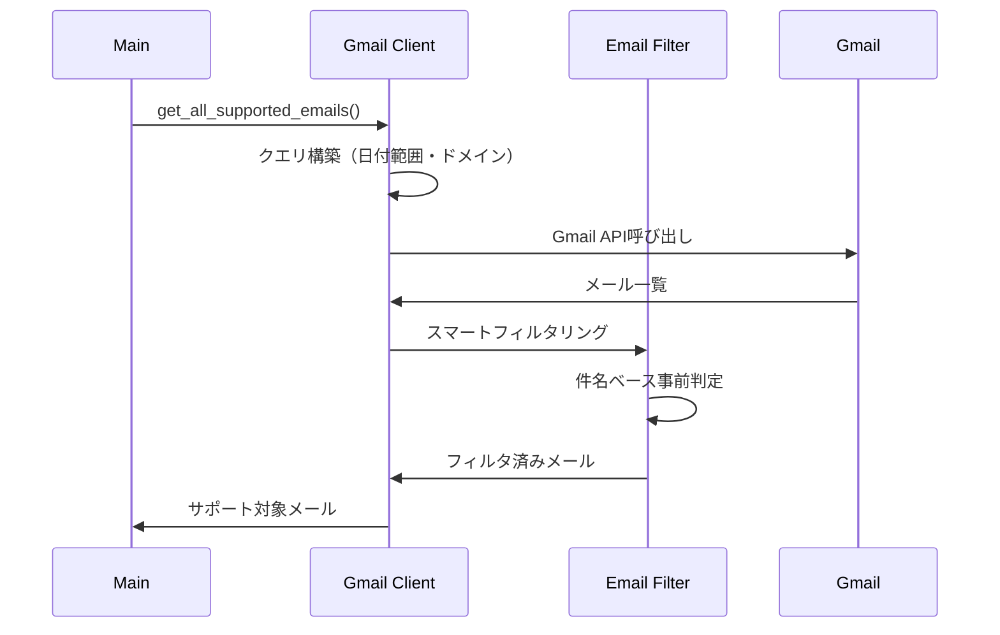
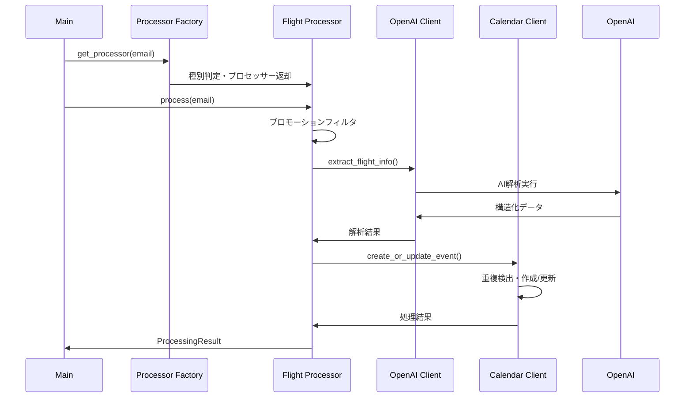
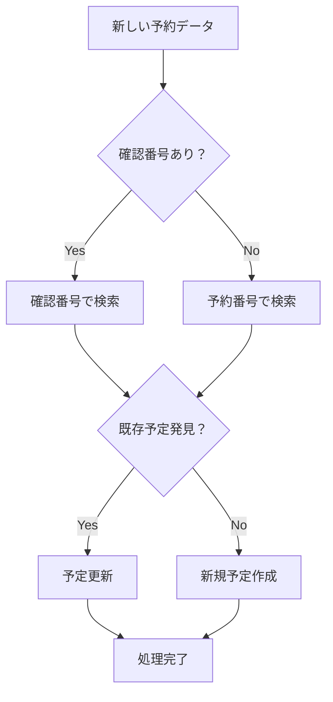
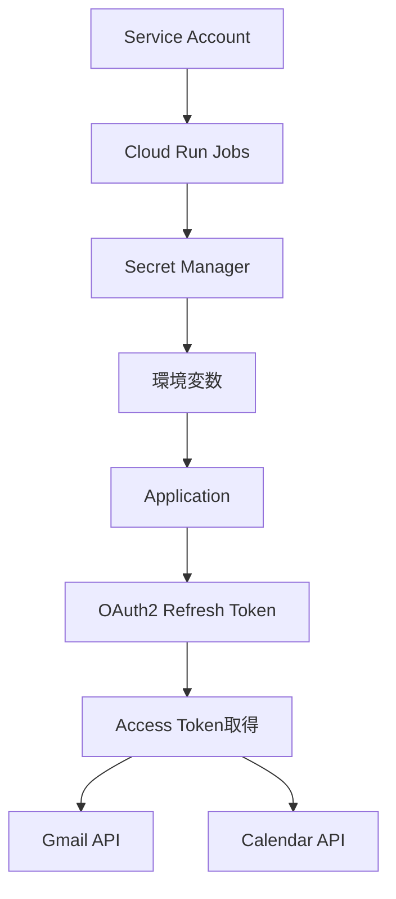

# 🏗️ System Architecture

Gmail Calendar Syncの詳細なシステムアーキテクチャドキュメント

## 📋 目次

- [システム概要](#システム概要)
- [アーキテクチャパターン](#アーキテクチャパターン)
- [コンポーネント設計](#コンポーネント設計)
- [データフロー](#データフロー)
- [セキュリティ設計](#セキュリティ設計)
- [拡張性設計](#拡張性設計)

## システム概要

Gmail Calendar Syncは、AI駆動のメール解析システムとして設計されており、以下の主要コンポーネントで構成されています：



### 設計原則

1. **型安全性**: Pydanticによる実行時データ検証
2. **拡張性**: プロセッサーパターンによる新メール種別対応
3. **保守性**: 明確な責任分離と依存性注入
4. **堅牢性**: 包括的エラーハンドリングと重複検出
5. **効率性**: スマートフィルタリングによるAPI最適化

## アーキテクチャパターン

### 1. Factory Pattern (ファクトリーパターン)

メール種別に応じた適切なプロセッサーを動的に選択：

```python
# processors/factory.py
class EmailProcessorFactory:
    def get_processor(self, email: EmailMessage) -> Optional[BaseEmailProcessor]:
        for processor in self._processors:
            if processor.can_process(email):
                return processor
        return None
```

**利点**:
- 新しいメール種別の追加が容易
- 既存コードの変更なしで機能拡張
- 処理ロジックの独立性確保

### 2. Strategy Pattern (ストラテジーパターン)

メール種別ごとの解析戦略を切り替え：

```python
# processors/base.py
class BaseEmailProcessor(ABC):
    @abstractmethod
    def can_process(self, email: EmailMessage) -> bool:
        """このプロセッサーでメールを処理できるかチェック"""

    @abstractmethod
    def process(self, email: EmailMessage) -> ProcessingResult:
        """メール処理を実行"""
```

**実装例**:
- `FlightEmailProcessor`: 航空券専用処理
- `CarShareEmailProcessor`: カーシェア専用処理

### 3. Dependency Injection (依存性注入)

テスタビリティと拡張性を向上：

```python
# main.py
def main() -> None:
    settings = get_settings()
    gmail_client = GmailClient(settings)
    calendar_client = CalendarClient(settings)
    processor_factory = EmailProcessorFactory(settings)

    process_emails(gmail_client, calendar_client, processor_factory, settings)
```

## コンポーネント設計

### 1. Models Layer (データモデル層)

Pydanticベースの型安全なデータモデル：



**特徴**:
- 実行時型検証による早期エラー検出
- 自動バリデーション・シリアライゼーション
- IDE支援による開発効率向上

### 2. Services Layer (サービス層)

外部API連携を抽象化：

#### Gmail Client
```python
class GmailClient:
    def get_all_supported_emails(
        self,
        since_days: Optional[int] = None,
        since_hours: Optional[int] = None,
        start_date: Optional[str] = None,
        end_date: Optional[str] = None
    ) -> List[EmailMessage]:
        """期間指定でサポート対象メールを取得"""
```

#### Calendar Client
```python
class CalendarClient:
    def create_or_update_event(
        self,
        event_data: CalendarEventData,
        duplicate_check_field: str
    ) -> str:
        """重複検出付きでイベント作成/更新"""
```

#### OpenAI Client
```python
class OpenAIClient:
    def extract_flight_info(self, email_content: str) -> Dict[str, Any]:
        """航空券情報をAI解析で抽出"""

    def extract_carshare_info(self, email_content: str) -> Dict[str, Any]:
        """カーシェア情報をAI解析で抽出"""
```

### 3. Processors Layer (処理層)

メール種別ごとの処理ロジック：



**共通処理フロー**:
1. **前処理**: スマートフィルタリング
2. **AI解析**: OpenAI APIによる情報抽出
3. **重複検出**: 確認番号/予約番号ベース
4. **カレンダー操作**: 新規作成または更新
5. **後処理**: ラベル付与・ログ出力

### 4. Utils Layer (ユーティリティ層)

横断的機能を提供：

#### Configuration Management
```python
class Settings(BaseSettings):
    # Gmail API
    gmail_client_id: str
    gmail_client_secret: str
    gmail_refresh_token: str

    # Calendar API
    calendar_client_id: str
    calendar_client_secret: str
    calendar_refresh_token: str

    # OpenAI API
    openai_api_key: str

    # Optional Settings
    slack_webhook_url: Optional[str] = None
    sync_period_hours: Optional[int] = None
    sync_period_days: int = 30
    log_level: str = "INFO"
```

#### Structured Logging
```python
def configure_logging(log_level: str, json_format: bool = False) -> None:
    """構造化ログの設定"""
    processors = [
        structlog.processors.TimeStamper(fmt="iso"),
        structlog.processors.add_log_level,
        structlog.processors.StackInfoRenderer(),
    ]

    if json_format:
        processors.append(structlog.processors.JSONRenderer())
    else:
        processors.append(structlog.dev.ConsoleRenderer(colors=True))
```

## データフロー

### 1. メール取得・フィルタリング



### 2. メール処理・AI解析



### 3. 重複検出メカニズム



**重複検出ルール**:
1. **確認番号優先**: より正確な一意識別
2. **予約番号フォールバック**: 確認番号がない場合
3. **時間ベース競合解決**: カーシェアの同時刻予約防止
4. **ステータス追跡**: 予約→変更→キャンセル→完了

## セキュリティ設計

### 1. 認証・認可



**セキュリティ対策**:
- OAuth2による最小権限アクセス
- リフレッシュトークンの安全な保存
- 個人情報の自動マスキング
- Secret Managerによる機密情報管理

### 2. データ保護

- **ログマスキング**: APIキー・個人情報の自動マスク
- **最小権限**: 必要最小限のAPIスコープ
- **一時的処理**: メール内容の永続化なし
- **暗号化通信**: HTTPS/TLS必須

## 拡張性設計

### 1. 新メール種別追加手順

新しいメール種別（例：ホテル予約）を追加する場合：

#### Step 1: データモデル定義
```python
# src/models/hotel.py
class HotelBooking(BaseModel):
    confirmation_code: str
    hotel_name: str
    check_in_date: date
    check_out_date: date
    guest_name: str
    room_type: Optional[str] = None
```

#### Step 2: プロセッサー実装
```python
# src/processors/hotel_processor.py
class HotelEmailProcessor(BaseEmailProcessor):
    def can_process(self, email: EmailMessage) -> bool:
        return email.domain in self.settings.hotel_domains

    def process(self, email: EmailMessage) -> ProcessingResult:
        # ホテル固有の処理ロジック
        pass
```

#### Step 3: ファクトリー登録
```python
# src/processors/factory.py
def __init__(self, settings: Settings):
    self._processors = [
        FlightEmailProcessor(settings),
        CarShareEmailProcessor(settings),
        HotelEmailProcessor(settings),  # 追加
    ]
```

#### Step 4: 設定追加
```python
# src/utils/config.py
class Settings(BaseSettings):
    hotel_domains: list[str] = ["booking.com", "hotels.com"]
```

### 2. AI プロンプト拡張

新しいメール種別のAI解析プロンプト：

```python
def extract_hotel_info(self, email_content: str) -> Dict[str, Any]:
    prompt = """
    以下のホテル予約メールから情報を抽出してください：

    出力形式（JSON）:
    {
        "confirmation_code": "確認番号",
        "hotel_name": "ホテル名",
        "check_in_date": "YYYY-MM-DD",
        "check_out_date": "YYYY-MM-DD",
        "guest_name": "宿泊者名"
    }
    """
```

### 3. API 拡張ポイント

- **Custom Webhook**: Slack以外の通知サービス対応
- **Multiple Calendars**: 複数カレンダーへの振り分け
- **AI Model Selection**: OpenAI以外のLLM対応
- **Database Integration**: 処理履歴の永続化

## パフォーマンス最適化

### 1. API呼び出し最適化

```python
# スマートフィルタリングによるOpenAI API節約
def should_process_with_ai(self, email: EmailMessage) -> bool:
    promotional_patterns = [
        "キャンペーン", "お知らせ", "メンテナンス",
        "プレゼント", "特典", "ポイント"
    ]

    subject_lower = email.subject.lower()
    return not any(pattern in subject_lower for pattern in promotional_patterns)
```

### 2. 重複検出最適化

```python
# 確認番号→予約番号の階層的検索
def find_existing_event(self, booking_data: Dict) -> Optional[str]:
    # 1. 確認番号での高速検索
    if confirmation_code := booking_data.get("confirmation_code"):
        if event_id := self._search_by_confirmation(confirmation_code):
            return event_id

    # 2. 予約番号でのフォールバック検索
    if booking_ref := booking_data.get("booking_reference"):
        return self._search_by_booking_ref(booking_ref)

    return None
```

### 3. メトリクス収集

```python
# OpenAI API使用量追跡
class OpenAIMetricsCollector:
    def record_api_call(self, model: str, tokens_used: int, cost: float):
        self.total_calls += 1
        self.total_tokens += tokens_used
        self.total_cost += cost

    def log_summary(self):
        logger.info(
            "OpenAI API Usage Summary",
            total_calls=self.total_calls,
            total_tokens=self.total_tokens,
            total_cost=self.total_cost
        )
```

## モニタリング・ログ

### 1. 構造化ログ

```python
logger.info(
    "Processing email",
    email_id=email.id,
    subject=email.subject[:100],
    domain=email.domain,
    processing_time=processing_time
)
```

### 2. エラー追跡

```python
try:
    result = processor.process(email)
except Exception as e:
    logger.error(
        "Unexpected error processing email",
        email_id=email.id,
        error=str(e),
        traceback=traceback.format_exc()
    )
```

### 3. 成功指標

- **処理成功率**: 全メール中の成功処理割合
- **AI解析精度**: 正確な情報抽出率
- **重複検出精度**: 誤判定・見逃し率
- **API レスポンス時間**: 各サービスの応答性能

---

📚 詳細な実装については [API.md](API.md) と [examples/](examples/) を参照してください。
